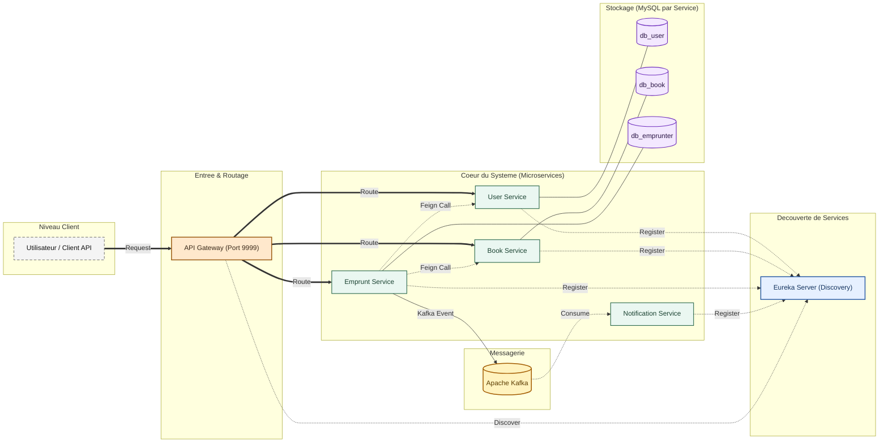

# Gestion des Emprunts de Livres 
Ce projet illustre une application de gestion des emprunts de livres en architecture microservices. Il met en pratique Spring Cloud (Gateway, Eureka, OpenFeign), la persistance MySQL par service, et la communication asynchrone via Kafka. L'ensemble est orchestre avec Docker Compose.

## Objectifs
- Separer les responsabilites par microservice (utilisateurs, livres, emprunts, notifications).
- Garantir l'independance des donnees (Database per Service).
- Combiner des flux synchrones (REST/Feign) et asynchrones (Kafka).
- Offrir un point d'entree unique via un API Gateway.

## Architecture generale
L'application est composee de 6 composants principaux :
1) Eureka Server : registre de services.
2) API Gateway : point d'entree unique (routage et load balancing).
3) User Service : gestion des utilisateurs.
4) Book Service : gestion du catalogue.
5) Emprunt Service : logique metier des emprunts.
6) Notification Service : consommation des evenements Kafka.

### Schema (Mermaid)



## Flux fonctionnels

### Flux synchrone (API)
1) Le client envoie une requete au Gateway.
2) Le Gateway route vers le microservice cible.
3) Les services s'appellent entre eux via Feign (ex: Emprunt -> User/Book).

### Flux asynchrone (Kafka)
1) Emprunt Service publie un evenement "emprunt-created".
2) Notification Service consomme l'evenement.
3) Le service de notification trace/traite l'information.

## Description des services

### Eureka Server
- Role : registre des services et decouverte.
- Port local : 8761.

### API Gateway
- Role : point d'entree unique, routage, load balancing.
- Port local : 9999.

### User Service
- Role : gestion des utilisateurs.
- Base : `db_user`.

### Book Service
- Role : gestion du catalogue de livres.
- Base : `db_book`.

### Emprunt Service
- Role : creation et gestion des emprunts, publication d'evenements.
- Base : `db_emprunter`.

### Notification Service
- Role : consommation Kafka et journalisation.

## Stack technique
- Java 17
- Spring Boot 3.4.1
- Spring Cloud 2024.0.0 (Eureka, Gateway, OpenFeign, LoadBalancer)
- MySQL 8.0 (une base par service)
- Kafka + Zookeeper (Wurstmeister)
- Docker & Docker Compose
- Maven

## Structure du depot

```text
MSA/
|-- eurika/                 # Eureka Discovery Server
|-- gateway/                # Spring Cloud Gateway
|-- user/                   # Microservice utilisateurs
|-- book/                   # Microservice catalogue
|-- emprunter/              # Microservice emprunts
|-- notification-service/   # Service de notifications (Kafka Consumer)
|-- mysql-init/             # Scripts SQL d'initialisation
|-- docker-compose.yaml     # Orchestration des conteneurs
|-- pom.xml                 # POM parent (aggregator)
```

## Lancer le projet

### Prerequis
- Java 17+
- Maven 3.8+
- Docker Desktop

### 1) Build des modules

```bash
mvn clean install -DskipTests
```

### 2) Demarrer l'infrastructure et les services

```bash
docker-compose up --build
```

> Le premier pull d'images peut prendre du temps (Kafka, MySQL).

## Tests rapides (cURL)

### Creer un utilisateur

```bash
curl -X POST http://localhost:9999/user-service/api/users   -H "Content-Type: application/json"   -d '{"name":"Jean Dupont","email":"jean@mail.com"}'
```

### Creer un livre

```bash
curl -X POST http://localhost:9999/book-service/api/books   -H "Content-Type: application/json"   -d '{"title":"Le Petit Prince","author":"Saint-Exupery"}'
```

### Creer un emprunt (declenche Kafka)

```bash
curl -X POST http://localhost:9999/emprunt-service/emprunts/1/1
```

### Verifier la notification
Consultez les logs Docker : le service `notification-service` doit tracer la reception.

## Points d'acces utiles

| Service | URL locale |
| :--- | :--- |
| Eureka Dashboard | http://localhost:8761 |
| Gateway (Root) | http://localhost:9999 |
| User API | http://localhost:9999/user-service/api/users |
| Book API | http://localhost:9999/book-service/api/books |
| Emprunt API | http://localhost:9999/emprunt-service/emprunts |

## Auteurs
- Realise par : Yassine BOULGUANT (INSEA)
- Encadre par : M. Driss Riane
