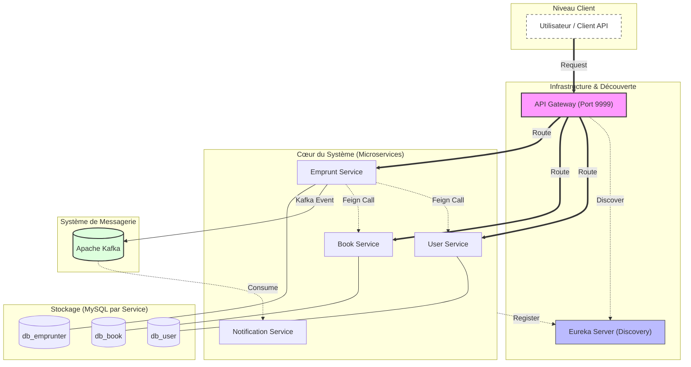

# Gestion des Emprunts de Livres — Microservices Spring Boot

Application de gestion d’emprunts construite en microservices. Le projet met en pratique **Spring Cloud**, la communication **REST/Feign** et la messagerie **Kafka**, le tout orchestré avec **Docker Compose**.

## En bref
- Gestion des utilisateurs, des livres et des emprunts.
- Services découplés et bases de données isolées par service.
- Flux synchrone (API) + asynchrone (événements Kafka).

---

## Vue d’ensemble de l’architecture
Le système suit le pattern **Database per Service** pour garantir l’indépendance des données.

### Schéma



### Services principaux
1. **Eureka Server** : registre de services.
2. **API Gateway** : point d’entrée unique et routage.
3. **User Service** : gestion des utilisateurs (`db_user`).
4. **Book Service** : gestion du catalogue (`db_book`).
5. **Emprunt Service** : logique métier + événements Kafka (`db_emprunter`).
6. **Notification Service** : consommation Kafka et notifications/logs.

---

## Flux métier (cycle d’un emprunt)
1. **Démarrage** : les services s’enregistrent auprès d’Eureka.
2. **Appel client** : requête via la Gateway pour créer un emprunt.
3. **Contrôle** : `Emprunt Service` vérifie l’utilisateur et le livre (Feign).
4. **Sauvegarde** : l’emprunt est persisté dans `db_emprunter`.
5. **Événement** : publication sur `emprunt-created`.
6. **Notification** : `Notification Service` consomme l’événement.

---

## Stack technique
- **Java 17**, **Spring Boot 3.4.1**
- **Spring Cloud 2024.0.0** (Eureka, Gateway, OpenFeign, LoadBalancer)
- **MySQL 8.0** (3 bases dédiées)
- **Kafka + Zookeeper** (Wurstmeister)
- **Docker & Docker Compose**
- **Maven**

---

## Organisation du dépôt

```text
MSA/
├── eurika/                 # Eureka Discovery Server
├── gateway/                # Spring Cloud Gateway
├── user/                   # Microservice utilisateurs
├── book/                   # Microservice catalogue
├── emprunter/              # Microservice emprunts
├── notification-service/   # Service de notifications (Kafka Consumer)
├── mysql-init/             # Scripts SQL d’initialisation
├── docker-compose.yaml     # Orchestration des conteneurs
└── pom.xml                 # POM parent (aggregator)
```

---

## Lancer le projet

### Prérequis
- **Java 17+**
- **Maven 3.8+**
- **Docker Desktop**

### 1) Builder les modules
```bash
mvn clean install -DskipTests
```

### 2) Démarrer l’infrastructure et les services
```bash
docker-compose up --build
```

Le premier pull d’images peut être un peu long (Kafka, MySQL).

---

## Tests rapides (cURL)
Lorsque tous les services sont **UP** dans Eureka : [http://localhost:8761](http://localhost:8761)

### Créer un utilisateur
```bash
curl -X POST http://localhost:9999/user-service/api/users \
  -H "Content-Type: application/json" \
  -d '{"name":"Jean Dupont","email":"jean@mail.com"}'
```

### Créer un livre
```bash
curl -X POST http://localhost:9999/book-service/api/books \
  -H "Content-Type: application/json" \
  -d '{"title":"Le Petit Prince","author":"Saint-Exupéry"}'
```

### Créer un emprunt (déclenche Kafka)
```bash
curl -X POST http://localhost:9999/emprunt-service/emprunts/1/1
```

### Vérifier la notification
Consultez les logs Docker : un message de `notification-service` confirme la réception.

---

## Points d’accès utiles

| Service | URL locale |
| :--- | :--- |
| **Eureka Dashboard** | [http://localhost:8761](http://localhost:8761) |
| **Gateway (Root)** | [http://localhost:9999](http://localhost:9999) |
| **User API** | [http://localhost:9999/user-service/api/users](http://localhost:9999/user-service/api/users) |
| **Book API** | [http://localhost:9999/book-service/api/books](http://localhost:9999/book-service/api/books) |
| **Emprunt API** | [http://localhost:9999/emprunt-service/emprunts](http://localhost:9999/emprunt-service/emprunts) |

---

## Auteurs & encadrement
- **Réalisé par : Yassine BOULGUANT** — **INSEA**
- **Encadré par : M. Driss Riane**

